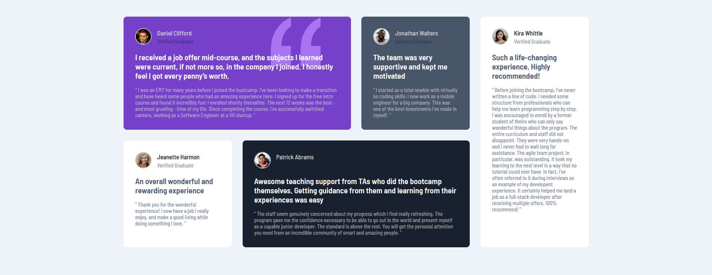

# Frontend Mentor - Testimonials grid section solution

This is a solution to the [Testimonials grid section challenge on Frontend Mentor](https://www.frontendmentor.io/challenges/testimonials-grid-section-Nnw6J7Un7). Frontend Mentor challenges help you improve your coding skills by building realistic projects. 

## Table of contents

- [Overview](#overview)
  - [The challenge](#the-challenge)
  - [Screenshot](#screenshot)
  - [Links](#links)
- [My process](#my-process)
  - [Built with](#built-with)
  - [What I learned](#what-i-learned)
  - [Continued development](#continued-development)
  - [Useful resources](#useful-resources)
- [Author](#author)
- [Acknowledgments](#acknowledgments)

**Note: Delete this note and update the table of contents based on what sections you keep.**

## Overview

### The challenge

Users should be able to:

- View the optimal layout for the site depending on their device's screen size

### Screenshot




### Links

- Solution URL: [Add solution URL here]
- Live Site URL: [Add live site URL here]

## My process

### Built with

- Semantic HTML5 markup
- CSS custom properties
- Flexbox
- CSS Grid

### What I learned

I learned how to use display grid and also learn to span across the grid I am happy that I made this without following a tutorial

Some CSS code I'm proud of
```css
.testimonial-cards .cards {
    display: grid;
    grid-template-columns: repeat(4, 1fr);
    gap: 2rem;
    max-width: 1400px;
    margin-left: auto;
    margin-right: auto;
    margin-top: 50px;
    margin-bottom: 50px;
}

.testimonial-cards .cards .card {
    background-color: var(--white);
    border-radius: 10px;
    padding: 35px;
}

.testimonial-cards .cards .first-card {
    background: var(--moderate-violet);
    grid-column: 1/3;
}

.testimonial-cards .cards .fourth-card {
    background: var(--very-dark-blackish-blue);
    color: var(--white);
    grid-column: 2 / 4;
}

.testimonial-cards .cards .fifth-card {
    grid-column: 4/4;
    grid-row: 3/1;
}
```

### Continued development

- CSS GRID, I kind of understand it but not yet used to it

### Useful resources

- [Example resource 1](https://www.youtube.com/watch?v=MxEtxo_AaZ4) - This helped me to learn about positioning in css and it was helpful in positioning the quotation svg in the first card

## Author

- Name - Induwara Thisarindu"# Testimonials-grid-section-frontend-mentor" 
